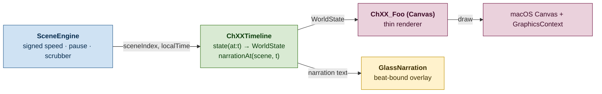

# CrisisViz

A native macOS 26 / SwiftUI keynote-style visualizer for the Crisis consensus protocol. Ten chapters, roughly eighteen minutes of curated playback at $1\times$, scrubbable forward and backward at any signed rate from $-16\times$ to $+16\times$.

CrisisViz consumes a recorded simulation from `crisis_data.json` and replays it with narration bound to specific narrative beats — the playhead is the master of time.

---

## The serial-timeline pattern

Every chapter is a **pure function of normalized time**. Given a chapter with an ordered list of beats $b_0, b_1, \ldots, b_{n-1}$ each with duration $d_i$, the world state at time $t \in [0, T]$ (where $T = \sum d_i$) is:

$$\text{state}(t) = \mathop{\textrm{fold}}_{i\,:\,\sum_{j<i} d_j \le t} (b_i, \text{state}_{\text{init}})$$

That is: replay every beat whose start lies before $t$, accumulating into a `WorldState` struct. Pure ⇒ scrubbable ⇒ reverse-playable. No monotonic accumulators, no animation state hidden in `@State`.



### The chapters

| # | File pair | Beats | $T$ at $1\times$ | Concept |
|---|---|--:|--:|---|
| 0 | `Ch01_Problem.swift` + `Ch00Timeline.swift` | 12 | ~43 s | Four friends, one ledger, no boss |
| 1 | `Ch02_Graph.swift` + `Ch01Timeline.swift` | ~75 | ~326 s | Asynchronous gossip & Lamport DAG |
| 2 | `Ch03_Partition.swift` + `Ch02Timeline.swift` | 27 | ~115 s | Network partition splits the graph |
| 3 | `Ch04_Rounds.swift` + `Ch03Timeline.swift` | 17 | ~72 s | Witness weight → round boundary |
| 4 | `Ch05_Voting.swift` + `Ch04Timeline.swift` | 15 | ~63 s | Virtual voting via strongly-seeing paths |
| 5 | `Ch06_Leader.swift` + `Ch05Timeline.swift` | 10 | ~48 s | Leader election |
| 6 | `Ch07_Order.swift` + `Ch06Timeline.swift` | 11 | ~52 s | Total order — convergence guarantee |
| 7 | `Ch08_DA_Problem.swift` + `Ch07Timeline.swift` | 14 | ~69 s | Data availability: gossip ≠ storage |
| 8 | `Ch09_DA_Design.swift` + `Ch08Timeline.swift` | 19 | ~85 s | Erasure shards + Merkle proofs |
| 9 | `Ch10_Byzantine.swift` + `Ch09Timeline.swift` | 18 | ~80 s | $f < n/3$ fork detection |

Naming gotcha: **chapter renderers are 1-indexed** (`Ch01..Ch10`), **timelines are 0-indexed** (`Ch00Timeline..Ch09Timeline`). They pair off-by-one. The renderer file's number matches the user-facing chapter label.

---

## Build · run · test · distribute

```sh
swift build                        # dev binary
swift run CrisisViz                # launch dev binary (no Dock icon)
./bundle.sh                        # build + assemble CrisisViz.app + open
./bundle.sh --no-launch            # build only
swift run CrisisViz --testbed      # PNG + MP4 + invariants harness
./package-dmg.sh                   # build CrisisViz.dmg for distribution
```

For first-time setup and prerequisites see [`../INSTALL.md`](../INSTALL.md).

---

## Testbed outputs

`swift run CrisisViz --testbed` writes everything to `~/Desktop/CrisisViz_Testbed/`:

| File | What it verifies |
|---|---|
| `INVARIANTS.md` | 38 logical curriculum assertions (cast colors, lane Y positions, scene staging) |
| `SOURCE_AUDIT.md` | Regex audit of all `.swift` files — forbidden patterns like `hashJitterY`, `palette[i]`, hardcoded colors |
| `MANIFEST.md` | PNG sweep across all scenes × time offsets $\{0, 2, 4, 6, 8\}\,\text{s}$ |
| `VIDEO_CLIPS.md` | 36 MP4 clips at $8\,\text{s} / 30\,\text{fps}$, one per scene |
| `SANITY.md` | File-size + freeze-frame heuristic checks (catches dead canvases) |

All five must be green before shipping curriculum changes. The testbed verifies **layout and logical claims**; it cannot evaluate animation smoothness — that requires running the live app and watching.

---

## Controls

| Input | Action |
|---|---|
| **← / →** | previous / next scene (across all chapters) |
| **Space** | play / pause |
| Bottom slider | signed speed, $-16\times$ to $+16\times$ |
| Chapter scrubber | jump to any chapter |
| Click a vertex | open the vertex inspector overlay |

---

## Cast convention

The visualizer adopts a fixed cast of named players over a subset of the simulation's process IDs:

| Lane | Name | Role |
|---|---|---|
| 0 | **Aaron** | leader-eligible honest |
| 1 | **Ben** | honest |
| 2 | **Carl** | honest |
| 3 | **Dave** | the Byzantine in Chapter 9 |
| 4+ | anonymous peers | the rest of the simulated nodes |

Hard rules:

- **Lane = lifeline.** Vertices sit exactly on their player's lane Y. No jitter, ever. Source audit forbids reintroducing `hashJitterY`.
- **Strictly serial.** Never two simultaneous events on screen at the same time.
- **Introduce before show.** A cast member's lane is invisible until their `introduce(...)` beat fires.
- **One detail slot.** The top-center "composing / open-envelope" panel is a single fixed rectangle; only one envelope occupies it at a time.

---

## Architecture pointers

| Concern | File |
|---|---|
| `@main`, activation policy, window clamping | `Sources/CrisisViz/App/CrisisApp.swift` |
| Playback controller (signed speed, scrubber) | `Sources/CrisisViz/Engine/SceneEngine.swift` |
| Pure per-chapter timelines | `Sources/CrisisViz/Engine/ChNNTimeline.swift` |
| Cast → color → lane mapping | `Sources/CrisisViz/Engine/DataManager.swift` |
| Chapter metadata, scene routing | `Sources/CrisisViz/Model/ChapterDefinitions.swift` |
| Cast definitions | `Sources/CrisisViz/Model/Cast.swift` |
| Main canvas + inter-chapter morph | `Sources/CrisisViz/Views/ImmersiveView.swift` |
| DAG layout (lane = lifeline) | `Sources/CrisisViz/Canvas/DAGLayoutEngine.swift` |
| Bottom controls bar | `Sources/CrisisViz/Glass/GlassControls.swift` |
| Beat-bound narration overlay | `Sources/CrisisViz/Glass/GlassNarration.swift` |
| Testbed entry points | `Sources/CrisisViz/Testbed/` |

For the engineering log oriented at the next coding agent, see [`HANDOFF.md`](HANDOFF.md).
