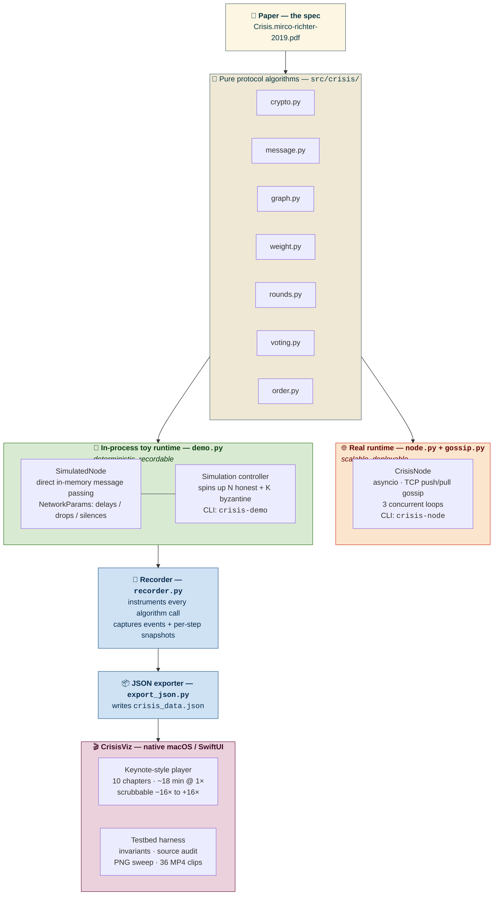

# crisis

A proof-of-concept and educational artifact for Mirco Richter's [_Crisis_ paper](Crisis.mirco-richter-2019.pdf) — a DAG-based BFT consensus protocol that achieves total order on messages in fully open, unstructured peer-to-peer networks through **virtual voting**: votes are never sent explicitly but are deduced from the causal relationships encoded in Lamport graphs.

This repository contains:

- a **Python implementation** of the protocol (`src/`, `tests/`),
- an **event recorder** that exports a deterministic simulation run to JSON,
- **CrisisViz** — a native macOS / SwiftUI curriculum visualizer that walks the protocol end-to-end across ten chapters: cast intro, gossip mechanics, partition, round derivation, virtual voting, leader election, total order, the data-availability problem, erasure-coded recovery, and Byzantine fork detection.

Everything in the visualizer is in extreme slow motion and serialized for didactic clarity. A signed speed slider scrubs the chapter forward and backward at any rate from $-16\times$ to $+16\times$; narration is bound to whichever beat the playhead is on.

---

## Architecture at a glance



**Key architectural fact** — the recording pipeline that feeds CrisisViz only exercises the **`SimulatedNode`** path (in-process, deterministic, in-memory message passing). The **`CrisisNode`** TCP runtime is a separately developed PoC of how a real network deployment would look; it is _not_ what produces `crisis_data.json`. The two runtimes are siblings, not layers.

---

## Repository layout

```
crisis/                                       ← git root
├── Crisis.mirco-richter-2019.pdf             the paper
├── README.md                                  this file
├── INSTALL.md                                 fresh-macOS install guide
├── LICENSE                                    MIT (code only; paper is CC-BY-4.0)
├── pyproject.toml                             Python ≥3.11, networkx, pytest
├── crisis_data.json                           simulation export (source of truth)
│
├── src/crisis/                                ── PROTOCOL PoC (Python) ──
│   ├── crypto.py, message.py                  random-oracle hash + Message/Vertex
│   ├── graph.py, weight.py, rounds.py         Lamport DAG + PoW weight + round derivation
│   ├── voting.py, order.py                    BBA virtual voting + total order
│   ├── gossip.py, node.py                     real TCP runtime (CrisisNode)
│   ├── demo.py                                in-process simulation harness
│   ├── recorder.py                            event instrumentation
│   └── export_json.py                         JSON exporter for CrisisViz
├── tests/                                     pytest suite
│
└── CrisisViz/                                 ── VISUALIZER (Swift / macOS 26) ──
    ├── Package.swift, bundle.sh, package-dmg.sh
    ├── Sources/CrisisViz/                     App, Engine, Model, Chapters, Views, Glass, Testbed, Canvas
    ├── README.md                              Swift-side human guide
    └── HANDOFF.md                             agent-to-agent engineering log
```

---

## Quick start

There are three audiences. Pick the one that matches what you want to do.

### 🧮 Verify the protocol — pytest

```sh
cd crisis
source .venv/bin/activate    # set up per INSTALL.md if first time
pytest -q
```

Runs the algorithm unit tests (crypto, graph, rounds, weight, message, order, voting, recorder, simulation). Should be green in under a second.

### 🧪 Run a deterministic simulation — Python CLI

```sh
python -m crisis.demo --nodes 4 --byzantine 1 --rounds 10
```

Spins up four honest + one byzantine `SimulatedNode`, runs ten consensus rounds in-process with a deterministic seed, prints the resulting total order. To export a fresh `crisis_data.json` for CrisisViz:

```sh
python -m crisis.export_json --steps 80 -o crisis_data.json
cp crisis_data.json CrisisViz/Sources/CrisisViz/crisis_data.json
```

### 🎬 Watch the visualizer — Swift / macOS

```sh
cd CrisisViz
./bundle.sh          # builds CrisisViz.app and opens it
# or:
./package-dmg.sh     # builds CrisisViz.dmg for distribution
```

Then arrow keys ←/→ to navigate, **Space** to play/pause, the bottom slider to scrub at any signed speed from $-16\times$ to $+16\times$.

---

## Where to read next

- **[INSTALL.md](INSTALL.md)** — clone-to-running on a fresh macOS box. Prerequisites, Python venv setup, Swift toolchain, regenerating sim data, troubleshooting.
- **[CrisisViz/README.md](CrisisViz/README.md)** — Swift-side guide: serial-timeline pattern, testbed outputs, controls, cast convention.
- **[CrisisViz/HANDOFF.md](CrisisViz/HANDOFF.md)** — engineering log for the next coding agent: current state, architecture pointers, hard-won rules.

---

## License

- **Code** (`src/`, `tests/`, `CrisisViz/`) is licensed under the [MIT License](LICENSE).
- **Paper** (`Crisis.mirco-richter-2019.pdf`) by Mirco Richter is a separately licensed artifact under CC-BY-4.0.
