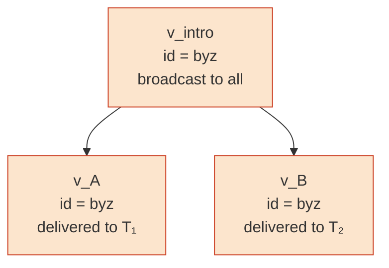

# DESIGN — `crisis_agents`

> **Audience.** Engineers and curriculum authors who need to *reason about whether the design is correct*, not just run it. The [README](README.md) is the lobby; this is the reference. Where the README walks you through a scenario, this document states invariants and argues them.

## Abstract

We formalize the design of `crisis_agents`, the AI-agent coordination layer built on the Crisis consensus protocol. We state two invariants the design enforces — **no chokepoint** ($\S 2$) and **no clock** ($\S 1$) — and argue them from the protocol's primitives. We give a structural definition of byzantine equivocation ($\S 3$) and show it is detectable from any honest agent's vantage. We identify the chain-constraint trap that our first gossip-propagation attempt hit and explain why the byzantine's "introduction" emission is structurally necessary ($\S 4$). We derive the alarm-ratification quorum threshold $q = \lceil 2N/3 \rceil$ from the standard BFT bound ($\S 5$), argue termination of the asynchronous event loop ($\S 6$), explain why an `AlarmClaim` is cryptographically signed for free by being an ordinary Crisis message ($\S 7$), enumerate failure modes ($\S 8$), discuss the design space we chose from ($\S 9$), and map every invariant to the test file that enforces it ($\S 10$).

---

## 0. Notation and preliminaries

| Symbol | Meaning |
|---|---|
| $G = (V, E)$ | A Lamport graph: directed acyclic graph of vertices |
| $v$ | A vertex; wraps a `Message` plus locally-computed fields |
| $v.\text{id}$ | The vertex's stable virtual process id (32 bytes) |
| $H(m)$ | Cryptographic digest of message $m$ (random-oracle model) |
| $v_1 \preceq v_2$ | $v_1$ happens before $v_2$ (timelike, $v_2 \in \text{future}(v_1)$) |
| $v_1 \mathbin{\\|} v_2$ | $v_1$ and $v_2$ are spacelike: $\neg(v_1 \preceq v_2) \wedge \neg(v_2 \preceq v_1)$ |
| $V_a$ | The vertex set of agent $a$'s `LamportGraph` |
| $\text{past}(v)$ | The set of all vertices $v' \preceq v$ |
| $N$ | Total number of agents in the boundary after `open_boundary()` |
| $f$ | Maximum number of byzantine agents the network tolerates |
| $q$ | Quorum threshold for alarm ratification |
| $w(v)$ | Vertex weight (proof-of-work) |
| $A_h, A_b$ | The honest and byzantine subsets of agents |

The agent layer reuses the protocol primitives directly: `LamportGraph` from `crisis.graph`, `Message`/`Vertex` from `crisis.message`, and the core detection primitive `LamportGraph.find_mutations` from `crisis.graph`. Paper references throughout cite [Crisis (Richter, 2019)](../../Crisis.mirco-richter-2019.pdf).

---

## 1. The asynchronicity model

### 1.1 What the protocol assumes

Crisis assumes a **fully asynchronous unstructured P2P network** (paper, §4 and §5.9): no upper bound on message delivery time, no synchronized clocks, no central coordinator. The agent layer inherits the assumption.

### 1.2 What synchronicity exists

The only synchronicity in Crisis is **virtual** — derived inside the consensus algorithm from the DAG's causal structure. The round number $r(v)$ assigned to vertex $v$ by `crisis.rounds.compute_rounds` is a function of $\text{past}(v)$ and the proof-of-work weights it accumulates; **nothing about wall-clock time enters**.

The agent layer does not invoke `compute_rounds` because it only needs mutation detection (a graph property, not a round property). The principle nonetheless applies: nothing externally synchronous is allowed.

### 1.3 The driver loop, formally

```
run_until_quiescent(max_steps):
    step ← 0
    repeat:
        progress ← false
        for each agent a:
            if a.try_emit() produces emissions:
                route_emission(...);  progress ← true
        if run_gossip_round() produces transfers:
            progress ← true
        for each agent a:
            if a.pending_alarm_claims() produces claims:
                broadcast_alarm(...);  progress ← true
        step ← step + 1
    until not progress or step ≥ max_steps
```

Three properties matter:

- **No turn argument is exposed to agents.** `CrisisAgent.try_emit()` has signature `(self) → list[AgentTurn]`. Agents in an asynchronous network do not observe a global tick.
- **The order (emission → gossip → alarm) is one specific scheduler choice.** Other valid schedulers (random, priority-based, agent-driven) would also be correct. The protocol does not depend on this ordering — it depends only on each step *eventually* happening.
- **Termination is by quiescence, not by step count.** `max_steps` is a safety bound. $\S 6$ argues termination formally.

### 1.4 Relationship to the paper's §5.9

The paper describes Crisis as "infinite parallel loops" running concurrently on every node: gossip, message generation, consensus. Our in-process driver is the single-process analog: instead of $N$ event loops running on $N$ machines, we have one event loop that cycles through $N$ in-memory agents. The interleaving is different; the semantic content is the same.

A future deployment over `crisis.gossip.GossipServer` replaces the in-process loop with $N$ independent agent loops, with no agent-layer code change.

---

## 2. The chokepoint principle

### 2.1 Definition

Let $O$ be an entity in the network. $O$ is a **chokepoint** for byzantine detection iff

$$\big[\text{network can detect}\big] \;\Longrightarrow\; \big[O \text{ holds state inaccessible to honest agents}\big].$$

Equivalently: removing $O$ would prevent detection. A protocol with chokepoints has single points of failure even if those points are not themselves byzantine.

### 2.2 Claim

Our design contains no chokepoint. The mothership is a bootstrap and scheduler; it holds no state that honest agents do not also hold in the limit of eventual gossip consistency.

### 2.3 Proof sketch

**Setup.** Let $A = A_h \cup A_b$ with $|A| = N$ and $|A_b| = f < N/3$. Let the byzantine $b \in A_b$ emit a forking pair $v_1, v_2 \in V$ with $v_1.\text{id} = v_2.\text{id} = b.\text{id}$ and $v_1 \mathbin{\\|} v_2$. By the byzantine's emission script there exist non-empty disjoint $T_1, T_2 \subseteq A$ such that $v_1$ is initially delivered to $T_1$ and $v_2$ to $T_2$.

**Lemma (eventual consistency of gossip).** For any honest agent $a \in A_h$ and any vertex $v \in V$ that exists somewhere in the network, there is a finite gossip schedule after which $v \in V_a$, provided the chain-link prerequisite from $\S 4$ holds (the byzantine's intro vertex must exist in $a$'s graph first; our scenario ensures this).

**Main argument.** By the lemma applied to $v_1$ and $v_2$, every $a \in A_h$ eventually has $\{v_1, v_2\} \subseteq V_a$. The past relation in $V_a$ is monotone under graph extension — adding vertices can only enlarge $\text{past}(v)$, never shrink it. Since $v_1 \mathbin{\\|} v_2$ holds globally (neither was delivered with knowledge of the other), it holds in every $V_a$. Therefore

$$\forall a \in A_h:\quad \{v_1, v_2\} \in \texttt{a.graph.find\_mutations}(b.\text{id}).$$

**Conclusion.** Every honest agent independently detects the equivocation from its own vantage. No privileged observer is required. ∎

### 2.4 What the mothership actually does

The mothership has two roles, both unprivileged:

- **Bootstrap.** Knows the initial member set; introduces a joiner via `open_boundary`. Bootstrap is unavoidable in any P2P system — you must know at least one peer to begin.
- **Scheduler.** Runs the event loop. In our PoC this is in-process for testability; in a deployed system, each agent runs its own loop and the mothership disappears.

Neither role reads any agent's internal state. The regression test `test_no_chokepoint_attribute_on_mothership` asserts the mothership exposes no `all_graphs`, `graph_of`, `_graphs`, or `scan_for_mutations` attribute — a sentinel against re-introducing the chokepoint.

---

## 3. Equivocation as a structural DAG property

### 3.1 Definition (paper, Definition 4.2)

Two vertices $v_1, v_2 \in V$ in a Lamport graph $G$ are a **mutation** of a virtual process iff

$$v_1.\text{id} = v_2.\text{id} \quad \wedge \quad v_1 \mathbin{\\|} v_2.$$

That is, they share an emitter id but are causally incomparable: each was emitted without acknowledging the other.

### 3.2 Why this is byzantine

A correct emitter maintains a **single chain**: each new message references its prior same-id message via `digests`. The chain forms a path in $G$, so any two vertices from an honest emitter are timelike — one $\preceq$ the other.

A byzantine intentionally forks: it emits two messages neither referencing the other, dispatched to disjoint peer subsets $T_1, T_2$. Each receiver, seeing only one variant, accepts it. After gossip cross-pollinates, the full DAG reveals the fork as a same-id spacelike pair.

### 3.3 Why detection needs no consensus

Equivocation is **structural** — a property of the DAG that any process with the relevant vertices can verify by direct examination. `LamportGraph.find_mutations(id)` returns the answer deterministically; no voting is required.

Consensus (the paper's BBA-based virtual leader election) is needed for *agreement on which value is canonical* — a fundamentally different problem. The agent layer never invokes `compute_safe_voting_pattern` or `compute_virtual_leader_election` because detection of *who lied* is strictly cheaper than agreement on *what is true*.

---

## 4. The chain-constraint trap

### 4.1 What went wrong in attempt 1

First design: the byzantine emits variant $v_A$ (delivered to $T_1$) and $v_B$ (to $T_2$), both with empty `digests`. Gossip then tries to propagate $v_B$ to agents in $T_1$ who already have $v_A$.

This **fails** at `message_integrity` step 6 (paper, §4.2, Algorithm 2):

> If there is a vertex $v$ in $G$ with $v.\text{id} = m.\text{id}$, one of $m.\text{digests}$ must reference $v$ (or a vertex in $v$'s past).

For $a \in T_1$ already holding $v_A$: $a$'s graph contains a vertex with $v_B.\text{id}$. The new message $v_B$ must reference *some* vertex of that id — but $v_B.\text{digests} = \emptyset$. Rejected. Equivocation cannot propagate via gossip.

### 4.2 The fix: an introduction vertex

The byzantine first broadcasts a benign **introduction** $v_\text{intro}$ with $v_\text{intro}.\text{id} = b.\text{id}$. After gossip, $v_\text{intro} \in V_a$ for every $a \in A_h$.

The byzantine's two equivocating variants then both chain to $v_\text{intro}$:

$$H(v_\text{intro}) \in v_A.\text{digests} \quad \wedge \quad H(v_\text{intro}) \in v_B.\text{digests}.$$

Now when $v_B$ tries to extend $a$'s graph (with $v_A, v_\text{intro} \in V_a$): $v_B$ references $v_\text{intro}$, which is in $V_a$ and has the right id. Step 6 satisfied. Accepted.

### 4.3 The structural picture



$v_A$ and $v_B$ are siblings under $v_\text{intro}$. Neither references the other. Therefore $v_A \mathbin{\\|} v_B$ in every graph that holds both. `find_mutations(b.id)` returns $\{v_A, v_B\}$.

### 4.4 Why this isn't a design wart

A real-world byzantine has the same constraint and the same workaround: it must establish presence in the network before it can equivocate, because equivocation requires the network to already know its id. In a deployed network the "introduction" is just the byzantine's first honest-looking emission. We model it explicitly in the scenario for legibility — it lets the reader see the fork pattern cleanly.

---

## 5. Quorum threshold derivation

### 5.1 The BFT bound

We assume up to $f$ byzantine agents out of $N$ with $f < N/3$. This is the classical Lamport bound for asynchronous BFT; the paper's §6 proves Crisis tolerates exactly this.

### 5.2 Choosing $q$

For the alarm-voting layer we need a quorum size $q$ satisfying two constraints.

**Safety.** Any ratified alarm must reflect honest consensus, not byzantine collusion. If $q \leq f$, then the $f$ byzantines could alone ratify any false alarm. So $q > f$. Stronger: to ensure any two valid quorums overlap in at least one honest signer (and therefore cannot disagree), we require

$$q \geq 2f + 1.$$

**Liveness.** Honest agents alone must be able to reach quorum — otherwise the protocol cannot ratify even valid alarms. So

$$q \leq N - f.$$

The two constraints are simultaneously satisfiable iff $2f + 1 \leq N - f \iff 3f + 1 \leq N \iff f < N/3$, which is exactly the BFT bound.

### 5.3 The chosen form

We pick

$$q = \left\lceil \frac{2N}{3} \right\rceil.$$

For $N$ divisible by $3$ this equals $2f + 1$ (the smallest safe choice). For other $N$ it is one greater than strictly necessary — slightly conservative, but uniform and easy to remember.

### 5.4 Worked example: $N = 4, f = 1$

$$q = \lceil 8/3 \rceil = 3.$$

Implications:

- A single byzantine acting alone cannot ratify ($1 < 3$).
- All three honest agents must concur — which by $\S 2$ they do, because each independently detects the same equivocation.
- One byzantine + one duped honest agent ($2 < 3$) still cannot ratify, which is the desired property: the honest agent's "dupe" status is irrelevant once the byzantine's lie is structurally visible.

---

## 6. Termination of the event loop

### 6.1 Claim

`Mothership.run_until_quiescent` terminates with `QuiescenceReport.reached_quiescence = True` for every well-formed scenario (finite agent scripts, finite byzantine emission set).

### 6.2 Proof

Define a **monotone progress measure**: let $\mathcal{D}(s)$ be the union, over all agents, of message digests in their graphs *and* the union of alarm-keys in their `_already_alarmed` sets after step $s$:

$$\mathcal{D}(s) = \bigcup_{a \in A} \big( \{H(m) : m \in V_a \} \cup \{k : k \in a.\text{\_already\_alarmed}\} \big).$$

**Boundedness.** $\mathcal{D}(s)$ is bounded above by the total set of emissions the agent scripts can produce (finite by assumption) plus the set of distinct AlarmClaim payloads (bounded by the number of mutations, also finite).

**Monotonicity.** $\mathcal{D}(s+1) \supseteq \mathcal{D}(s)$. Each loop body either adds a new vertex digest to some agent's graph (emission, gossip-acceptance, or alarm receive), adds an alarm-key to some agent's `_already_alarmed`, or does nothing.

**Strict growth on progress.** If a loop iteration sets `progress ← true`, at least one of the operations was non-trivial: an emission was routed (new digest), a gossip pair transferred (new digest at receiver), or an alarm was emitted (new alarm-key at sender + new digest at receivers). In every case $|\mathcal{D}(s+1)| > |\mathcal{D}(s)|$.

**Conclusion.** $|\mathcal{D}|$ strictly increases on each progress step and is bounded above. So progress steps are finite. The first step with no progress sets the loop's exit condition. ∎

### 6.3 Liveness

In our test scenarios the loop terminates in 3–7 steps. The `max_steps=200` cap is two orders of magnitude above what is needed. `QuiescenceReport.reached_quiescence` distinguishes natural termination from a cap-out.

---

## 7. AlarmClaim as a first-class Crisis payload

### 7.1 No new protocol

An `AlarmClaim` is a JSON payload distinguished only by `kind = "alarm"`. It is wrapped into an ordinary Crisis `Message` via the agent's `_build_message` machinery — same chain-link logic, same cross-reference logic, same PoW nonce mining. It then enters the gossip layer like any other vertex.

### 7.2 Why this gives us cryptographic signing for free

Any recipient who has the AlarmClaim's `Message` can:

1. Recompute $H(\text{message})$ and verify it matches the claimed digest.
2. Verify the nonce satisfies the network's PoW threshold.
3. Read `message.id` to learn which process emitted it.

The process_id is a stable cryptographic identifier (derived as $\text{digest}(\text{name})[:32]$). The PoW nonce is unforgeable in the random-oracle model. Therefore an AlarmClaim is cryptographically attributable to its emitter **without any separate identity PKI**.

### 7.3 Quorum over signed claims

`tally_alarms(graph, threshold)` groups vertices by `(accused, statement_id, witness_pair)` and counts unique signer process_ids. Because signers are cryptographically attributed, a byzantine cannot forge another agent's signature. The count is therefore a faithful count of *independent honest detectors who agree*, which is exactly what the quorum threshold requires.

### 7.4 Canonical witness pairs

For two detectors to "agree" on the same equivocation, they must produce identical AlarmClaim payloads. We canonicalize:

- `witness_digests` is always a sorted hex tuple — `tuple(sorted([d1, d2]))`. Two detectors observing the same fork therefore emit byte-identical witness pairs, which `tally_alarms` keys on.

This canonicalization happens in `LamportGraph.find_mutations` callers (`detect_mutations_in_graph` in `alarm.py`) so it cannot be bypassed by a careless subclass.

---

## 8. Failure-mode analysis

| Scenario | Outcome |
|---|---|
| Byzantine equivocates; all honest agents see both variants via gossip | Every honest agent detects; quorum met; alarm ratified. **Correct.** |
| Byzantine equivocates; gossip is partial (one honest agent sees only $v_A$) | Partial-view agent does not detect. Remaining detectors must alone meet $q$; if they do not, alarm sits un-ratified. **Correct conservative outcome** — no false ratification. |
| Byzantine emits false `AlarmClaim` against an honest agent | No honest agent seconds it (their graphs do not contain the alleged equivocation). Count $= 1 < q$. **Not ratified.** |
| Two colluding byzantines attempt to ratify a false alarm | Requires $2 \geq q = \lceil 2N/3 \rceil$, i.e. $N \leq 3$. Outside our threat model ($f < N/3$ requires $N \geq 4$). |
| Byzantine never emits anything | No alarm to detect. Network proceeds normally. |
| Byzantine emits intro but no equivocation | Network treats it as a benign new member. |
| Honest agent equivocates due to a bug | Detection mechanism fires regardless. This is correct: equivocation is byzantine *whether intentional or not*, and a byzantine-shaped vertex pair must be flagged so honest agents can react. |
| Gossip never reaches some honest agent (partition) | No detection from the isolated agent. As soon as the partition heals, gossip catches it up and detection fires. |

---

## 9. Trade-offs and what we didn't build

### 9.1 Quorum-count vs. full BBA voting

The paper's full virtual leader election (Algorithm 7) achieves agreement on a *value*. Our alarm domain is different: we need agreement on *who lied*, not on what the truth is. Equivocation is binary — either the fork exists in the DAG or it does not — so a simple count of cryptographically-signed independent observations suffices.

Cost difference is dramatic. We measured BBA convergence at $\text{pow\\_zeros}=1, \text{steps}=80, N=7$ in pure Python: minutes. Quorum-count over the same data: microseconds.

If a future scenario needs value-agreement (e.g., agreeing on which of two contradictory facts is canonical), the full BBA pipeline from `crisis.voting` is available and unchanged — it would be invoked on the application-layer payload, not on alarm claims.

### 9.2 In-process gossip vs. TCP

`crisis.gossip.GossipServer` exists and works over real sockets. We use in-process function calls because:

- Co-located agents (Claude sub-agents in one Python process)
- Determinism for tests
- Network reliability is a separate concern

A future deployment swaps in `GossipServer`; no `crisis_agents` code changes.

### 9.3 No second-order detection

If a byzantine emits a false `AlarmClaim`, the quorum threshold prevents ratification. We do not recursively raise a second-order alarm against the false-accuser. Doing so would be a stronger result — "we identified the lying accuser" — but is not necessary for correctness. The quorum unblock-by-default behavior is the necessary invariant.

### 9.4 No visualization

CrisisViz visualizes the protocol PoC's `crisis_data.json`, which comes from `crisis.demo.Simulation`. A future CrisisViz chapter set could absorb agent-coordination runs (multi-DAG rendering, gossip propagation, alarm-vote convergence) but would require new visual idioms. Out of scope for this PoC.

---

## 10. Tests as invariants

Each row maps an invariant claimed in this document to the test file that enforces it. If you weaken any invariant, at least one of these tests must fail.

| Invariant | Section | Test file → assertion |
|---|---|---|
| No chokepoint — honest agents agree | $\S 2$ | `test_no_chokepoint.py::test_all_honest_agents_agree_on_ratified_alarms` |
| No privileged state on mothership | $\S 2.4$ | `test_no_chokepoint.py::test_no_chokepoint_attribute_on_mothership` |
| Single byzantine accuser cannot ratify | $\S 8$ | `test_no_chokepoint.py::test_byzantine_alone_cannot_ratify` |
| No clock — agents see no turn argument | $\S 1.3$ | `test_async_quiescence.py::test_no_turn_argument_exposed_to_agents` |
| Local sequence numbers, not global clock | $\S 1.3$ | `test_async_quiescence.py::test_no_turn_field_on_alarmclaim` |
| Loop terminates | $\S 6$ | `test_async_quiescence.py::test_run_until_quiescent_terminates` |
| Two runs converge identically | $\S 1.3, \S 6$ | `test_async_quiescence.py::test_two_runs_produce_identical_final_state` |
| Async loop alone ratifies | $\S 1.3$ | `test_async_quiescence.py::test_alarms_propagate_through_async_loop_alone` |
| Decentralized detection | $\S 2.3, \S 3$ | `test_alarm.py::test_each_honest_agent_detects_the_same_mutation` |
| Canonical witness pairs | $\S 7.4$ | `test_alarm.py::test_all_honest_detectors_produce_canonical_witness_pairs` |
| Byzantine doesn't accuse itself | $\S 3$ | `test_alarm.py::test_byzantine_does_not_detect_its_own_equivocation` |
| Chain-link propagation via intro | $\S 4$ | `test_mothership.py::test_gossip_propagates_byzantine_equivocation` |
| Quorum formula | $\S 5.3$ | `test_vote.py::test_quorum_formulas` |
| Quorum met by 3 honest signers (N=4) | $\S 5.4$ | `test_vote.py::test_tally_meets_quorum` |
| Quorum blocks single signer | $\S 5.2$ | `test_vote.py::test_tally_blocks_single_signer` |
| Proof self-consistency catches tampering | $\S 7$ | `test_proof.py::TestSelfConsistentVerification` (whole class) |

The two **sentinel files** — `test_no_chokepoint.py` and `test_async_quiescence.py` — exist specifically to fail loudly if anyone reintroduces a chokepoint or a clock. Treat them as part of the design, not the test suite.

---

## Pointers

- [README](README.md) — pragmatic overview, build/run/test, demo
- [Parent README](../../README.md) — full repo architecture
- [Paper](../../Crisis.mirco-richter-2019.pdf) — Mirco Richter, _Crisis: Probabilistically Self Organizing Total Order in Unstructured P2P Networks_, 2019
