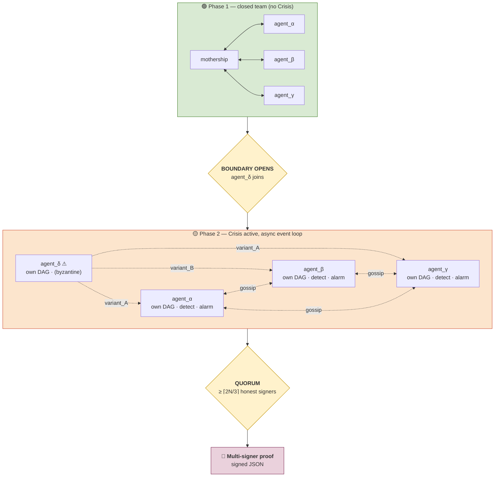

# crisis_agents — coordination layer for AI agent teams

A Python package that lifts the Crisis consensus protocol from "consensus between machines" to "consensus between AI agents." Each participant is a Crisis node with its own Lamport graph; the network catches byzantine equivocation via decentralized detection and quorum-ratified alarms. The engine is **asynchronous** and **event-driven** — no global clock, no privileged observer.

> **For the formal design** — invariants, proofs, derivations, failure modes, tests-as-invariants — see **[DESIGN.md](DESIGN.md)**. This README is the lobby; that document is the reference.
>
> For repo-wide orientation see the **[parent README](../../README.md)**.

---

## Threat model

A small team of AI agents is coordinated by an orchestrator we call the **mothership**.

- **Normal life** — the team is closed; agents talk directly with the mothership and each other. No Crisis layer needed.
- **Boundary opens** — an external agent of unknown trust joins. It may equivocate — telling one peer one thing while telling another peer the opposite — to mislead the network.
- **Crisis to the rescue** — from the moment the boundary opens, every claim is wrapped into a Crisis message with the emitter's stable process id and a PoW nonce. The per-agent Lamport DAG is the immutable, replayable ledger. Mutation detection catches equivocation; a quorum of independent detectors ratifies a multi-signer proof of malfeasance.

The headline architectural commitments — **no chokepoint**, **no clock** — are stated and argued formally in [DESIGN.md §2 and §1](DESIGN.md). Both are guarded by sentinel test files (`test_no_chokepoint.py`, `test_async_quiescence.py`).

---

## Architecture



The mothership shrinks to **bootstrap + scheduler**. Detection runs on each agent's own LamportGraph; alarms gossip as ordinary Crisis messages; ratification is a per-agent tally of independent signers. See [DESIGN.md §1–§7](DESIGN.md) for the formal walkthrough.

---

## Modules

| File | Role |
|---|---|
| `claim.py` | `Claim` payload — application-layer verdict + evidence |
| `boundary.py` | `Boundary` — trust set, `open()` trigger |
| `agent.py` | `CrisisAgent` (abstract) + `MockAgent` + `MockByzantineAgent` — each owns its `LamportGraph`, `emit_claim`, `receive`, `gossip_to`, `detect_mutations`, `pending_alarm_claims` |
| `live_agent.py` | `LiveClaudeAgent` — same interface, backed by real Anthropic API calls |
| `mothership.py` | `Mothership` — bootstrap + async event-loop driver; `run_until_quiescent()`; `ratified_alarms_from(name)` |
| `alarm.py` | `LocalAlarm` + `detect_mutations_in_graph(graph, ...)` — pure function on one agent's graph |
| `vote.py` | `AlarmClaim` payload, `quorum_for(n) = ⌈2n/3⌉`, `tally_alarms`, `RatifiedAlarm` |
| `proof.py` | `ProofDocument` (schema v2), `build_proof`, `verify_proof_self_consistent` |
| `cli.py` | `crisis-agents demo` + `crisis-agents verify` |
| `scenarios/fact_check.py` | The canonical demo scenario |
| `scenarios/reference_doc.txt` | The factual paragraph the demo adjudicates |

---

## Build · run · test

```sh
cd /path/to/crisis
source .venv/bin/activate
pip install -e ".[dev]"

# Full test suite (includes crisis_agents)
pytest -q                              # ~170 tests in ~0.8s

# Mocked, deterministic demo
crisis-agents demo --out-dir /tmp/demo

# Verify the emitted proof
crisis-agents verify /tmp/demo/proof_*.json
```

For real Claude sub-agents:

```sh
pip install -e ".[live]"
export ANTHROPIC_API_KEY=sk-ant-...
crisis-agents demo --live --model claude-haiku-4-5-20251001
```

The byzantine stays scripted even in `--live` mode (reliable equivocation matters more than full LLM realism). See [DESIGN.md §9.4](DESIGN.md) for why.

Setup from scratch on a fresh macOS box: see [`../../INSTALL.md`](../../INSTALL.md).

---

## What's deliberately out of scope

- **Visualization.** CrisisViz visualizes the protocol PoC; absorbing agent runs would need new visual idioms. Separate effort.
- **Real TCP gossip.** In-process function calls only. Lifting to multi-process plugs into `crisis.gossip.GossipServer` without `crisis_agents` code changes.
- **Cryptographic signatures beyond Crisis itself.** Crisis already provides nonces + digests + PoW; agent identity is `digest(name)[:32]`. No separate PKI. See [DESIGN.md §7](DESIGN.md).
- **Sybil resistance.** What PoW is for; not this layer's concern.
- **Detection of false claims that aren't equivocations.** Out-voted, not "caught." Catching them would require a ground-truth oracle, which is application-layer.
- **Second-order detection of false-accusers.** Quorum prevents ratification; second-order alarms are a stronger result we chose not to build. See [DESIGN.md §9.3](DESIGN.md).

---

## Pointers

- **[DESIGN.md](DESIGN.md)** — formal reference: invariants, proofs, the chain-constraint trap, quorum derivation, termination, failure-mode matrix, tests-as-invariants table
- **[Parent README](../../README.md)** — full repo architecture
- **[INSTALL.md](../../INSTALL.md)** — fresh-macOS install + demo guide
- **[Paper](../../Crisis.mirco-richter-2019.pdf)** — Mirco Richter, _Crisis: Probabilistically Self Organizing Total Order in Unstructured P2P Networks_, 2019
