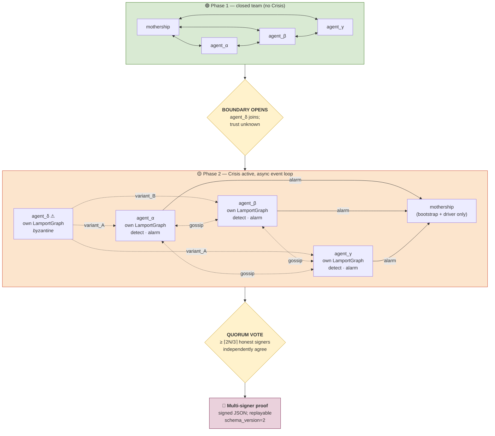

# crisis_agents — coordination layer for AI agent teams

A Python package that lifts the Crisis consensus protocol from "consensus between machines" to "consensus between AI agents." Each participant is a Crisis node with its own Lamport graph; the network catches byzantine equivocation via decentralized detection and quorum-ratified alarms. The engine is **asynchronous** and **event-driven** — no global clock, no privileged observer.

> If you're new to this repo, start at the [parent README](../../README.md). This document is the architectural reference for the agent layer.

---

## Threat model

The setting is a small team of AI agents (Claude sub-agents, in our live demo) coordinated by an orchestrator we call the **mothership**.

- **Normal life** — the team is closed. Agents talk freely with each other and the mothership. No Crisis layer; the conversation is the medium.
- **Boundary opens** — an external agent of unknown trust joins. Its internal motivation may diverge from the team's task. It may equivocate — telling one peer one thing while telling another peer the opposite — to mislead the network.
- **Crisis to the rescue** — from the moment the boundary opens, every claim is wrapped into a Crisis Message with the emitting agent's stable process_id and a PoW nonce. The per-agent Lamport DAG is the immutable, replayable ledger. Mutation detection (built on `LamportGraph.find_mutations` from the protocol layer) catches equivocation. Every honest agent who has gossiped enough to see both contradictory variants raises an alarm. A quorum of independent alarms produces a network-ratified proof of malfeasance.

What's deliberately **not** in scope (this is a PoC):

- Visualization. The CrisisViz application is a separate effort that visualizes the protocol PoC; visualizing an agent-coordination run would require a substantial new chapter set there.
- Real TCP gossip. Agents talk via in-process function calls in the mothership process. The existing `crisis.gossip.GossipServer` shows how it would look across sockets.
- Detection of *false claims that aren't equivocations*. An agent who consistently lies but never equivocates is out-voted, not "caught." Catching it would require a ground-truth oracle, which is application-layer, not protocol-layer.

---

## Two architectural principles, enforced by tests

### 1. No chokepoint

Every honest agent maintains **its own** `LamportGraph`. The mothership does NOT hold a privileged graph of the whole network. Detection runs on each agent independently; alarms are emitted by each detector independently; proofs are signed by a quorum of detectors.

The regression-test file `tests/test_no_chokepoint.py` asserts:

- After the full lifecycle, every honest agent's *ratified-alarms set* is byte-identical to every other honest agent's.
- The mothership does not expose `all_graphs`, `graph_of`, `_graphs`, or any other privileged collection.
- A single byzantine accuser alone cannot ratify an alarm.

### 2. No clock

Crisis is supposed to work in asynchronous P2P networks. Any synchronicity in the protocol is *virtual* — derived inside the consensus algorithm from the causal structure of the Lamport graph — not imposed from outside by a coordinator.

The driver loop is **event-driven and quiescence-terminated**, not turn-counted:

```python
def run_until_quiescent(max_steps=200):
    while progress:
        progress = False
        # 1. Any agent has something to emit? Let them speak.
        # 2. Any gossip pair has new info? Exchange.
        # 3. Any agent has detected a new mutation? Emit AlarmClaim.
```

`tests/test_async_quiescence.py` asserts:

- `CrisisAgent.try_emit()` takes no `turn` argument.
- `AlarmClaim` has no `detected_at_turn` field (the wall-clock-implying name); only `emitted_at_step`, which is a per-agent local sequence number.
- Two runs of the same scenario produce identical end states (determinism — no hidden wall-time dependence).
- The loop alone (no manual phase orchestration) ratifies an alarm.

---

## The mental model



---

## Six-phase walkthrough (the `crisis-agents demo`)

The canonical scenario is `scenarios/fact_check.py`: three honest agents and one byzantine adjudicate six factual statements about a small reference document.

### Phase 1 — closed team, no Crisis
The mothership drives `run_closed_phase()` until quiescent. Each honest agent emits its six fact-check claims via plain function calls — appended to a flat log. Per-agent LamportGraphs aren't yet allocated. **No Crisis overhead.**

### Phase 2 — boundary opens
`mothership.open_boundary(agent_delta)`. Atomically: δ is added to the trust set, a fresh `LamportGraph` is created on every agent (including δ), and `boundary.is_open` flips to `True`.

### Phase 3 — asynchronous event loop
`mothership.run_until_quiescent()`. The driver cycles through:

1. **Emission** — `agent.try_emit()` is called on each agent. Returned `AgentTurn`s are first-hop routed to their target subset (or broadcast). The byzantine emits an intro (broadcast), then a pair of contradictory variants (split delivery).
2. **Gossip** — every ordered pair `(sender, receiver)` exchanges what `sender` has that `receiver` doesn't. Eventually-consistent propagation.
3. **Alarm emission** — `agent.pending_alarm_claims()` runs `LamportGraph.find_mutations(...)` on each agent's own graph and produces `AlarmClaim`s for any newly observed equivocation. AlarmClaims are wrapped as Crisis Messages and broadcast.

The loop exits when none of these three concerns make progress. `QuiescenceReport` (returned) carries: `steps`, `emissions`, `gossip_transfers`, `alarm_claims_emitted`, `reached_quiescence`.

### Phase 4 — decentralized detection
Each agent independently runs `detect_mutations()` on its own graph. In our scenario, every honest agent observes the byzantine's same-id spacelike pair and reports it. The byzantine doesn't accuse itself.

### Phase 5 — ratification by quorum
The quorum threshold is

$$\text{quorum}(N) = \left\lceil \frac{2N}{3} \right\rceil$$

where $N$ is the boundary size at ratification. For our scenario $N=4$ (3 honest + 1 byzantine), so the threshold is $\left\lceil 2 \cdot 4 / 3 \right\rceil = 3$ — every honest agent must concur. `tally_alarms(graph, threshold)` groups AlarmClaim vertices by `(accused, statement_id, witness_pair)`, counts unique signer process_ids per group, and ratifies groups meeting the threshold. **All honest agents produce identical `RatifiedAlarm` lists** (this is the no-chokepoint property in action).

### Phase 6 — proof emission
`build_proof(ratified_alarm)` produces a self-contained JSON document. Schema:

```json
{
  "schema_version": 2,
  "accused_process_id_hex": "...",
  "statement_id": "s03",
  "witness_digests": ["...", "..."],
  "signer_process_id_hexes": ["...", "...", "..."],
  "quorum_threshold": 3,
  "summary": "agent id=... emitted contradictory Crisis vertices about ..."
}
```

`verify_proof_self_consistent(proof)` checks distinct witnesses, distinct signers, signer count ≥ threshold. Future Phase-6+ work: full replay verification that re-derives the alarm from a recorded simulation log.

---

## Module reference

| File | What it owns |
|---|---|
| `claim.py` | `Claim` dataclass — the application-layer payload (verdict + evidence) |
| `boundary.py` | `Boundary` — trust set, `open()` trigger |
| `agent.py` | `CrisisAgent` (abstract) + `MockAgent` + `MockByzantineAgent`. Each agent owns its `LamportGraph`, `emit_claim`, `receive`, `gossip_to`, `detect_mutations`, `pending_alarm_claims` |
| `live_agent.py` | `LiveClaudeAgent` — same interface, backed by real Anthropic API calls |
| `mothership.py` | `Mothership` — bootstrap + async event-loop driver. No privileged graph state. `run_closed_phase()`, `run_until_quiescent()`, `ratified_alarms_from(name)` |
| `alarm.py` | `LocalAlarm` + `detect_mutations_in_graph(graph, ...)` — pure function, runs on one agent's graph |
| `vote.py` | `AlarmClaim` payload, `RatifiedAlarm`, `quorum_for(n)`, `tally_alarms(graph, threshold)` |
| `proof.py` | `ProofDocument` (schema v2), `build_proof`, `verify_proof_self_consistent` |
| `cli.py` | `crisis-agents demo` + `crisis-agents verify` |
| `scenarios/fact_check.py` | The canonical demo scenario: reference doc, six statements, scripted agents |
| `scenarios/reference_doc.txt` | The factual paragraph the demo adjudicates |

---

## Reuse map from `src/crisis/`

Almost all the heavy lifting comes from the protocol layer; `crisis_agents` is a thin adapter.

| `src/crisis/` primitive | How `crisis_agents` uses it |
|---|---|
| `Message`, `Vertex` | Claims and AlarmClaims become `Message.payload`. Agent's stable id → `Message.id`. |
| `LamportGraph` | One per agent. `extend()`, `find_mutations()`, `are_spacelike()` all reused. |
| `LamportGraph.find_mutations(pid)` | The core of decentralized detection. Returns same-id spacelike groups. |
| `ProofOfWorkWeight` + `mine_nonce()` | Each emission's PoW comes from here, with a shared weight system across the network so PoW is verifiable across graphs. |
| `digest(name)[:ID_LENGTH]` | Agent process_id derivation. Same convention as `crisis.demo.Simulation` so agents could coexist with simulated nodes in a future mixed scenario. |

---

## Build · run · test

```sh
# From repo root, after setup per INSTALL.md
cd /path/to/crisis
source .venv/bin/activate
pip install -e ".[dev]"                  # editable install with pytest

# All tests, including crisis_agents
pytest -q                                # ~170 tests in 0.8s

# Just the agent layer
pytest tests/test_claim.py tests/test_boundary.py tests/test_agent*.py \
       tests/test_mothership.py tests/test_alarm.py tests/test_vote.py \
       tests/test_proof.py tests/test_demo_fact_check.py \
       tests/test_no_chokepoint.py tests/test_async_quiescence.py -v

# Run the demo (mocked, deterministic)
crisis-agents demo --out-dir /tmp/crisis_demo

# Run with real Claude sub-agents (requires API key + extras)
pip install -e ".[live]"
export ANTHROPIC_API_KEY=sk-ant-...
crisis-agents demo --live --model claude-haiku-4-5-20251001

# Verify a proof
crisis-agents verify /tmp/crisis_demo/proof_*.json
```

---

## The live-Claude path

`LiveClaudeAgent` (in `live_agent.py`) makes one Anthropic Messages API call per `try_emit()` invocation, asking Claude to fact-check the scenario's statements against the reference document. The response is parsed as a JSON array of `Claim`-shaped objects; malformed responses degrade gracefully (the agent emits nothing rather than crashing).

The byzantine joiner stays **mocked** even in `--live` mode: producing deterministic equivocation from an LLM requires multiple API calls per turn (one per peer subset) for unreliable yields, and the demo's narrative is cleaner with a scripted byzantine. The honest agents are the real LLM participants.

Default model: `claude-haiku-4-5-20251001` (fast, cheap, plenty of capability for structured-output adjudication). Override with `--model`.

The live path is intentionally not in CI — it costs API credits and has nondeterministic outputs.

---

## Test taxonomy

| Test file | What it asserts |
|---|---|
| `tests/test_claim.py` | Claim dataclass validation + JSON round-trip |
| `tests/test_boundary.py` | Boundary state machine (closed → open) |
| `tests/test_mothership.py` | Per-agent graph ownership; broadcast vs. targeted delivery; gossip propagation; no privileged attribute |
| `tests/test_alarm.py` | Decentralized detection; every honest agent finds the same mutation; canonical witness pairs |
| `tests/test_vote.py` | AlarmClaim round-trip; quorum formulas; tally determinism |
| `tests/test_proof.py` | ProofDocument schema; JSON round-trip; tampered-witness/below-quorum rejection |
| `tests/test_demo_fact_check.py` | End-to-end scenario produces one ratified alarm; CLI output contains all six phases |
| `tests/test_live_agent.py` | LiveClaudeAgent parsing (fake Anthropic client; no real API calls) |
| **`tests/test_no_chokepoint.py`** | **Centerpiece: every honest agent's ratified set is byte-identical; no privileged attributes exist** |
| **`tests/test_async_quiescence.py`** | **Centerpiece: no clock; `try_emit()` takes no arg; `AlarmClaim.detected_at_turn` doesn't exist; two runs converge identically** |

The two centerpiece files are sentinels — if you ever re-introduce a chokepoint or a wall clock, one of those tests should fail.

---

## What's deliberately out of scope

- **CrisisViz integration.** The visualizer's data file (`crisis_data.json`) is produced by `crisis.demo.Simulation`, not by `crisis_agents`. A future CrisisViz upgrade could absorb agent-coordination runs (multi-DAG rendering, gossip arrows, alarm-vote convergence) — but that's a separate effort, sketched in the parent README.
- **Real TCP gossip.** In-process function calls only. Lifting to multi-process requires plugging into `crisis.gossip.GossipServer` — independent work.
- **Cryptographic signatures beyond what Crisis already provides.** Crisis already provides nonces + message-digest chaining + PoW. Agent identity is `digest(name)[:32]`. We don't add a separate identity-PKI.
- **Sybil resistance.** Threat model is "a few byzantine joiners with valid PoW", not "an attacker spawning unlimited identities." Sybil defense is what the PoW weight in Crisis is *for*; it's not the agent layer's concern.
- **Byzantine false-accusations.** A byzantine could emit a false AlarmClaim against an honest agent. The quorum mechanism prevents ratification (honest agents won't second the false claim, so it stays at 1-of-N). Second-order detection of false accusers isn't in this PoC.

---

## Pointers

- Parent README: [`../../README.md`](../../README.md)
- Install guide: [`../../INSTALL.md`](../../INSTALL.md)
- The paper this is all based on: [`../../Crisis.mirco-richter-2019.pdf`](../../Crisis.mirco-richter-2019.pdf)
